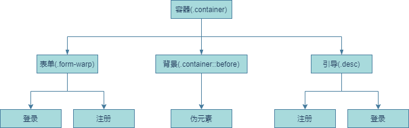

## HTML 结构

## JS
为引导按钮注册click事件
给容器增删样式

## CSS
外层容器：  
作为定位基准  

#### 背景：  
通过伪元素实现并将背景设置成线性渐变，大小超过窗口。这样在x周平移是会形成滚动视觉效果，并将z-index设置为顶层，便于在动画过程中隐藏其他元素。  
#### 表单容器：  
z-index低于背景，快递大小要能让出背景留白的空间显示。布局方式使用grid，因为有登录注册两个表单，相对于重复定位grid更为简便。

#### 引导容器：  
z-index不用设置。子元素设置为背景统计，并通过pointer-event属性实现事件穿透操作表单。

## 动画
背景：X：0 –> 100%；动画延迟0，动画时间1.8s  
表单容器：left：75% -> 25%；动画延迟1s，动画时间0.7s  
登录表单：z-index：4 -> 3  
注册表单：z-index：3 -> 4  
注册引导：X：800px –> 0  
登录引导：X：0 -> -800px  
引导内容：动画延迟0.6s，动画时间0.9s  
引导图片：动画延迟0.5s，动画时间0.9s  

## 响应式
逻辑与上述相似，不再赘述

## 有趣的知识点：
z-index：https://developer.mozilla.org/zh-CN/docs/Web/CSS/z-index  
pointer-event：https://developer.mozilla.org/zh-CN/docs/Web/API/Pointer_events  
display：grid：
https://developer.mozilla.org/zh-CN/docs/Web/CSS/grid | 
https://drafts.csswg.org/css-grid/#propdef-grid
transition-timing-function：https://developer.mozilla.org/zh-CN/docs/Web/CSS/transition-timing-function（可查看transition.html对比效果）